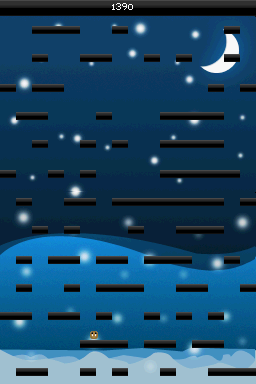

An historical archive for a project I created prior to any formal programming education.

# DownFall 1.0
By BassAceGold

DownFall is a custom fall down game for the DS. The object of the game is to last as long as you can by falling through platforms without hitting the top of the top screen. 

There are items in this game, some may help and others may act against you so be weary when you see the items drop in.

This game is fully themeable, you can view one of the current themes in the DownFall/Themes folder and drag and drop your own themes into the Themes folder.

Music is formatted via Mario Paint Composer DS files. The game scans your card for the MPCSongs folder and will play all the songs out of there.
Check out 

## Installation
- Copy DownFall Folder to the ROOT of your card
- DLDI Patch game (Most cards do this automatically)
- Play game